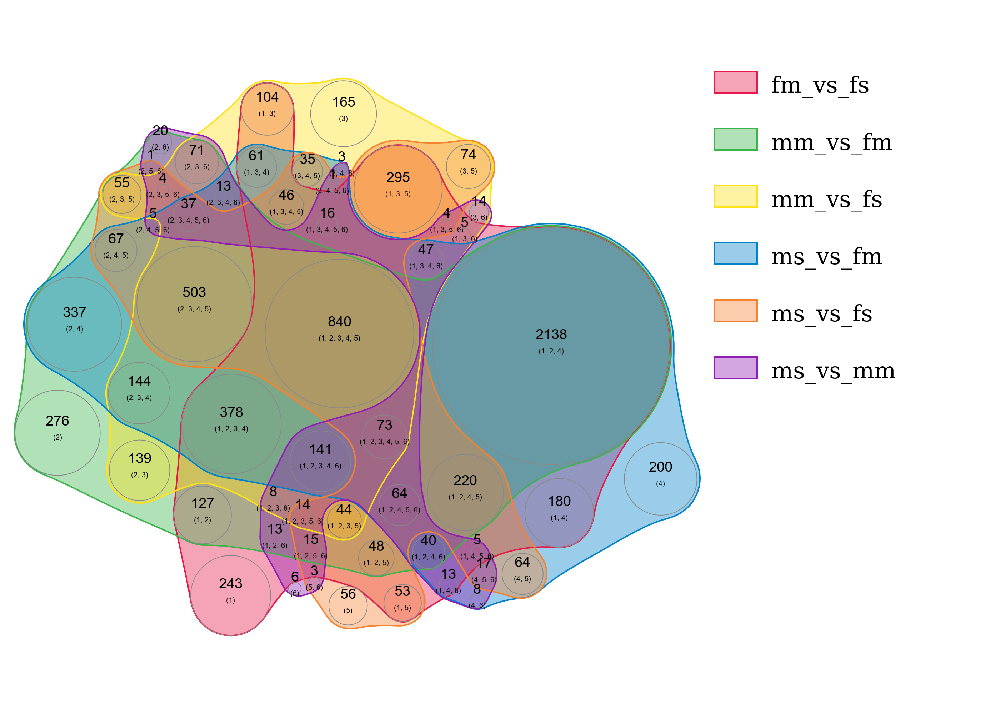

# Schistosoma mansoni differential gene expression

## Conditions

* Whole worms from single-sex infected rodents (non-matured adults) and mixed-sex infected rodents (matured)
* Gender of S. mansoni

## Sample numbers

12 samples

* 6 single infection
    + 3 female replicates, 3 male replicates

* 6 mixed infection
    + 3 female replicates, 3 male replicates

* ~5Gb per sample (gzipped)
* paired-end Illumina, 100bp


- my account on cube: data29@vlogin2.csb.univie.ac.at

- downloaded the paper and the technical note about the data (also .bibtex citations)


## Downloading the samples

- got the metadata file from ENA (Study: PRJEB14695) - selected needed columns for output

- used grep and the ena download tool to get the samples needed:

```bash
enatool=../tools/enaBrowserTools-master/python3/enaDataGet
metadata=../data/PRJEB14695.txt

acc=$(grep "whole" $metadata | cut -f4)
for a in $acc; do
	echo $a
	$enatool -m -f fastq -d ../data $a
done
```

- then merged the samples because they were multiplexed - but already separated by the Tag sequence after downloading.
Sorted the samples into directories first. Then used zcat and piped to gzip to merge the files:

```bash
dirs=$(ls)

for d in $dirs; do
	#echo $d
	forward=$(ls $d/*_1.fastq.gz)
	reverse=$(ls $d/*_2.fastq.gz)
	forward_merger="zcat $forward | gzip -c >$d/sample_1.fastq.gz"
	#echo $forward_merger
	reverse_merger="zcat $reverse | gzip -c >$d/sample_2.fastq.gz"
	#echo $reverse_merger
	eval $forward_merger
	eval $reverse_merger
done
```

samples were also linked for easier processing: 

```bash
samples=$(find /scratch2/data/weilguny/data/samples -name "*.fastq.gz")

for s in $samples; do
	name=$(basename $s)
	linking="ln -s $s $name"
	#echo $linking
	eval $linking
done
```


## Obtaining the genome and transcriptome

- downloaded the gff3 gene annotation and the genome (fasta) from ebi embl
http://metazoa.ensembl.org/Schistosoma_mansoni/Info/Index

- assembly ASM23792v2, from the Schistosoma Genome Network, Strain Puerto Rico

- diploid genome of ~270 MB, 7 pairs of autosomes, 2 sex chromosomes

- Whole Genome Shotgun sequencing, 3.8 million pooled reads, assembled with the Phusion assembly algorithm, estimated coverage 7X


- gff3 needs to be converted to GTF - used gffread cufflinks (-T for gtf-format, -o outputfile):

```bash
../tools/cufflinks-2.2.1.Linux_x86_64/gffread Schistosoma_mansoni.ASM23792v2.40.gff3 -T -o Smansoni.gtf
```

- checked integrity of gtf format afterwards: seems ok, also transcripts and genes have correct names to reflect hierarchy
- put all unique gene and transcript IDs in files

```bash
less smansoni.gtf | cut -f 9 | cut -d' ' -f4 | sort | uniq >uniq_genes
less smansoni.gtf | cut -f 9 | cut -d' ' -f2 | sort | uniq >uniq_transcripts
```


## Cube - Life Science Cluster Usage

- the data used during computation is copied to the cluster, into a tmp directory that is handled by slurm
- for testing the tmp was made by hand
 `$TMPDIR=/tmp/lukas; mkdir $TMPDIR`
- copy files out to temporary space
 `cp data $TMPDIR`
- run processes in tmp space
 `cd $TMPDIR; \ cmd`
- then copy the results back
 `cp -r $TMPDIR/results /local/space`
 
this is handled by Bob's tmpfile_env script:

- data and directories with flag `-i` and `-d`
- the command wrapped in `""` and containing `%i1 %d1` etc. as placeholders
- possibility to use `--test` to omit the copying out of data for local testing purposes

nq script usage:

- allocate memory with `--mem`
- cpus with `--cpus`
- select predefined settings with `--features array-8core`; good option for standard jobs with 8 cores
- `jobscript` as last argument

then submit with `sbatch job.slurm`
 
useful commands to check the state of the cluster: `squeue, sinfo`

## Indexing the genome

- STAR will be used for mapping, so a genome index has to be generated.
- testing command:

```bash
STAR --runMode genomeGenerate --genomeDir smansoni_index --sjdbGTFfile ../../data/smansoni.gtf --genomeFastaFiles ../../data/schistosoma_mansoni.PRJEA36577.WBPS10.genomic_masked.fa --runThreadN 8 
```

- actual command was wrapped with tmpfile_env (and processed by nq) to run on the cluster:

```bash
module load star
/proj/rpz/scripts/tmpfile_env --in ../../data/smansoni.gtf --in ../../data/schistosoma_mansoni.PRJEA36577.WBPS10.genomic_masked.fa --dir smansoni_index 'STAR --runMode genomeGenerate --genomeDir %d1 --sjdbGTFfile %i1 --genomeFastaFiles %i2 --runThreadN 8'
```

- the generated genome did not work for mapping, it caused segmentation faults.
- first tried adding `--genomeChrBinNbits 15`. Reccomended in the manual for big numbers of references, my genome contains many unplaced scaffold.
- what actually worked was reducing the prefix to the suffix array: `--genomeSAindexNbases 6`, working command:

```bash
STAR --runMode genomeGenerate --genomeDir smansoni_index_fixed --sjdbGTFfile ../../data/smansoni.gtf --genomeFastaFiles ../../data/schistosoma_mansoni.PRJEA36577.WBPS10.genomic_masked.fa --runThreadN 4 --genomeSAindexNbases 6
```


## Mapping the reads to the S. mansoni genome

- Trimming of reads omitted because of time constraints, straight to mapping
- subsampling for testing purposes, twice for paired-end reads:

```bash
zcat ../00_links/whole_female_mixed_infection_rep3_1.fastq.gz | head -n 40000 | gzip -c >subsample_1
zcat ../00_links/whole_female_mixed_infection_rep3_2.fastq.gz | head -n 40000 | gzip -c >subsample_2
```

- after testing locally, produced a script for submission
- mostly parameters used in ENCODE project were used (recommendations from STAR user manual):

- `--outFilterType BySJout` Consider splice junction criteria for spliced reads. SJout file from STAR is constructed after mapping that contains the putative splice junctions
- `--outSAMStype Bam Unsorted` we want a bam file as output, but without sorting (STAR is not efficient at sorting)
- `--outFilterMultimapNmax 20` allows 20 multi-mappings for each read
- redirect that to a new script and prep with nq for submission

```bash
forward=$(ls ../00_links/*_1.fastq.gz)

for f in $forward; do
	r=$(ls ../00_links/$(basename $f _1.fastq.gz)_2.fastq.gz)
	/proj/rpz/scripts/tmpfile_env --in ../01_index/smansoni_index_fixed --in $f --in $r \
	--dir $(basename $f _1.fastq.gz) --lock=L \
	'STAR --genomeDir %i1  --readFilesIn %i2 %i3 --runThreadN 8 --readFilesCommand zcat \
	--outFilterMultimapNmax 20 --outFileNamePrefix %d1/ --outFilterType BySJout --alignSJoverhangMin 8 \
	--alignSJDBoverhangMin 1 --outFilterMismatchNmax 999 --outFilterMismatchNoverReadLmax 0.04 \
	--alignIntronMin 20 --alignIntronMax 1000000 --alignMatesGapMax 1000000 --outSAMtype BAM Unsorted \
	--outTmpDir $TMPDIR/tmp'
done
```

- had to resubmit because of maintenance on the cluster, jobs were cancelled or directories deleted
- after mapping: check the output of stderr from the cluster:

```bash
head *.e* | less
```

- synced my directory on the cube to my own computer, since stuff in disappearing randomly

```bash
rsync -havPz --delete ~/cube /home/lukas/Schreibtisch/ada_backup/ --exclude samples --exclude processing -n
```

## Counting genes from alignment files

- for counting genes, the alignment files and the transcriptome (gtf) are used
- the chromosome names in both have to correspond. This is the case for me, since I have downloaded the genome and transcriptome from the same source and same assembly version

- featureCounts from the subread package was used for counting.
- to deal with overlapping genes: either in the case of gene + gene or gene + intergenic region: `--minOverlap --fracOverlap`
- parameters to activate the counting of multi-mapping reads, including weighting of individual instances: `-M --fraction`
- run the counting for each sample twice, once for unique mapping reads only, once for multi-mapping reads

```bash
bams=$(ls ../04_map2/*/Aligned.out.bam)
ann=../../data/smansoni.gtf
dir=uniq_map_only

mkdir $dir
for b in $bams; do
	o="$dir/$(echo $b | cut -f3 -d'/').counts"
	#echo $b
	#echo $o
	/proj/rpz/scripts/tmpfile_env --in $b --out $o --lock=L "featureCounts -p -a $ann -o %o1 %i1"
done
```


```bash
bams=$(ls ../04_map2/*/Aligned.out.bam)
ann=../../data/smansoni.gtf
dir=multi_map

mkdir $dir
for b in $bams; do
	o="$dir/$(echo $b | cut -f3 -d'/').counts"
	#echo $b
	#echo $o
	/proj/rpz/scripts/tmpfile_env --in $b --out $o --lock=L "featureCounts -p -M --fraction -a $ann -o %o1 %i1"
done
```


## Differential gene expression analysis

- SARtools is used for DGE between the samples, with the template file for DESeq2 provided on their github
- install sartools and dependencies via bioconductor/devtools/github - already had everything, updated all packages
- counting some replicates did not finish in time, so used some mock copies of other replicates for testing
- moved real replicates over once they were finished

- target file describes the files, conditions and labels within the template script
- rawDir contains the counts of the individual samples
- alpha was modified to 0.01
- result is a nicely polished report with diagnostic figures and tables of DEGs

```{r, echo=FALSE, results='asis'}
library(knitr)
suppressMessages(library(kableExtra))
target <- read.csv('target.txt', sep="\t")
kable(target, caption="Samples and associated conditions") %>%
  kable_styling(bootstrap_options = "striped", full_width = F)
```


- most settings were left unmodified
- function to load count data modified to round counts during loading, since fractional multi-mapping counts are floats

```{r, eval=FALSE}
loadCountData <- function(target, rawDir="raw", skip=0, featuresToRemove=c("alignment_not_unique", "ambiguous", "no_feature", "not_aligned", "too_low_aQual")){
    
    labels <- as.character(target[,1])
    files <- as.character(target[,2])
    
    # detect if input count files are from featureCounts or HTSeq-count
    f1 <- read.table(file.path(rawDir, files[1]), sep="\t", quote="\"", header=FALSE, nrows=1, stringsAsFactors=FALSE)
    if (ncol(f1) >= 6 && all(apply(f1[1,1:6], 2, is.character))){
        # counter featurecounts
        idCol <- 1
        countsCol <- 7
        header <- TRUE
    } else{
        if (ncol(f1) >= 2 && is.character(f1[1,1]) & is.numeric(f1[1,2])){
            # counter htseq-count
            idCol <- 1
            countsCol <- 2
            header <- FALSE
        } else{
            stop("Can't determine if count files come from HTSeq-count or featureCounts")
        }
    }
    
    rawCounts <- read.table(file.path(rawDir, files[1]), sep="\t", quote="\"", header=header, skip=skip, stringsAsFactors=FALSE)
    rawCounts <- rawCounts[,c(idCol, countsCol)]
    rawCounts[,2] <- round(rawCounts[,2])               #line added here
    colnames(rawCounts) <- c("Id", labels[1])
    if (any(duplicated(rawCounts$Id))) stop("Duplicated feature names in ", files[1])
    cat("Loading files:\n")
    cat(files[1],": ",length(rawCounts[,labels[1]])," rows and ",sum(rawCounts[,labels[1]]==0)," null count(s)\n",sep="")
    
    for (i in 2:length(files)){
        tmp <- read.table(file.path(rawDir, files[i]), sep="\t", quote="\"", header=header, skip=skip, stringsAsFactors=FALSE)
        tmp <- tmp[,c(idCol, countsCol)]
        tmp[,2] <- round(tmp[,2])                       #line added here
        colnames(tmp) <- c("Id", labels[i])
        if (any(duplicated(tmp$Id))) stop("Duplicated feature names in ", files[i])
        rawCounts <- merge(rawCounts, tmp, by="Id", all=TRUE)
        cat(files[i],": ",length(tmp[,labels[i]])," rows and ",sum(tmp[,labels[i]]==0)," null count(s)\n",sep="")
    }
    
    rawCounts[is.na(rawCounts)] <- 0
    counts <- as.matrix(rawCounts[,-1])
    rownames(counts) <- rawCounts[,1]
    counts <- counts[order(rownames(counts)),]
    
    # check that input counts are integers to fit edgeR and DESeq2 requirements
    if (any(counts %% 1 != 0)) stop("Input counts are not integer values as required by DESeq2 and edgeR.")
    
    cat("\nFeatures removed:\n")
    for (f in setdiff(featuresToRemove,"")){
        match <- grep(f, rownames(counts))
        if (length(match)>0){
            cat(rownames(counts)[match],sep="\n")
            counts <- counts[-match,]
        }
    }
    
    cat("\nTop of the counts matrix:\n")
    print(head(counts))
    cat("\nBottom of the counts matrix:\n")
    print(tail(counts))
    return(counts)
}

```


## Some new plotting libraries in R

- tried some new libraries: nVennR (https://academic.oup.com/bioinformatics/article-abstract/34/13/2322/4904268?redirectedFrom=fulltext)
- proportional venn diagrams with many sets
- looks pretty ridiculous for so many conditions, but nice Venn diagram for the report with 3 conditions. Selected the genes for hypothesis.



- and UpSetR (https://cran.r-project.org/web/packages/UpSetR/vignettes/basic.usage.html)
- takes a named list of vectors as input - convert with fromList()

- and treemap for hierarchical grouping of groups and area mapped to numeric value

```{r, eval=FALSE}
# tree map for DEGs
library(data.table)
library(treemap)
library(UpSetR)

extract_sign <- function(f){
    tab <- fread(f)
    tab_sign <- subset(tab, padj<0.01)
    sample_set <- tab_sign$Id
    #n <- length(sample_set)
}

basename <- function(name, type){
  name <- strsplit(name, split=type)[[1]][1]
  name_split <- strsplit(name, split="vs")
  name_mod <- paste(name_split[[1]][1], name_split[[1]][2], sep="_vs_")
}


interlace <- function(l1, l2, l3, common_len){
  full_list <- c()
  for (i in seq(1, common_len)){
    full_list <- c(l1[i], l2[i], l3[i], full_list)
  }
  return(full_list)
}

comb_subgroups <- function(names, vals){
  sub <- c()
  for (i in seq(1,length(names))){
    n <- paste(names[i], vals[i], sep="\n")
    sub <- c(sub, n)
  }
  return(sub)
}

# treemap
setwd("~/Desktop/report/DGE/tables/")

files_up <- list.files(pattern="up")
files_down <- list.files(pattern="down")
n_up <- sapply(files_up, extract_sign)
n_down <- sapply(files_down, extract_sign)
n_nondiff <- 13313 - (n_up + n_down)

conds <- sapply(names(n_up), basename, type=".up.")
groups <- c()
for (i in conds){groups <- c(rep(i,3), groups)}
subgroup_names <- rep(c("nondiff", "up", "down"), 6)
vals <- unname(interlace(n_nondiff, n_up, n_down, 6))
subgroups <- comb_subgroups(names = subgroup_names, vals=vals)

data <- data.frame(groups, subgroups, vals)

treemap(data, index=c("groups", "subgroups"), vSize="vals", type="index",
        title="Number of unaffected, up- and down- regulated genes",
        fontcolor.labels = "black", border.lwds=0, bg.labels=255, aspRatio = 2,
        ymod.labels=c(1,0), fontface.labels=c("italic", "plain"))


# upsetr
setwd("~/Desktop/report/DGE/tables/")
files <- list.files(pattern=".complete.")
deg <- sapply(files, extract_sign)
n <- sapply(names(deg), basename, type=".complete.")
names(deg) <- n
upset(fromList(deg), nsets = 6, order.by = "freq")
```


## Functional annotation


- run functional annotation with eggNOG-mapper on proteome
- eggNOG 0.99: `-m diamond --target_orthologs all --tax_scope auto`
- target all orthologs in their database, automatically select taxonomic scope, use DIAMOND mapper; apparently super fast

- DIAMOND flags: `blastp --more-sensitive -e 0.001 --top 3`
- e-value threshold of 0.001 (10 used by standard blast), top 3: only give results that are at most 3% worse than the best
  
```bash
./emapper.py --cpu 4 -i candidate_proteins_remchar_v2 -d all_eggNOG --output candidate_proteins_remchar_v2_out --hmm_maxseqlen 5000 -m diamond --target_orthologs all --tax_scope auto --go_evidence non-electronic

# diamond command used by emapper
diamond blastp -d eggnog_proteins.dmnd -q candidate_proteins_remchar_v2 --more-sensitive -e 0.001000 -o candidate_proteins_remchar_v2_out --top 3
```

## Phylogenetic analysis

- selected one candidate gene: Dmd-1 in Schmidtea mediterrana, ortholog in S. mansoni: DM3RTF
- transcription factor active during maturation
- got 15 orthologs from reciprocal blasting in blastp

- made a species tree with lifemap from uni lyon
- they have a new feature of exporting selected taxa in Newick format!


- did some alignments with mafft
- manual editing in Aliview - alignments look quite bad
- model finding with iqtree - lowest BIC for PMB + F + R3

```bash
mafft-einsi --ep 0 --genafpair --maxiterate 1000 multi_fasta >multi_align_out

~/software/iqtree-1.6.6-MacOSX/bin/iqtree -s multi_align_out -m MF
~/software/iqtree-1.6.6-MacOSX/bin/iqtree -s multi_align_out -m PMB+F+R3
```

- resulting trees do not make much sense - overall phylogeny is there
- but S. mansoni does not cluster with its sister species at all
- also no pattern about hermaphrodites and dioecous species
- other results?.. maybe not for report


## GO term enrichment of functional annotation

- loaded the data and filtered for significance
- select genes that are dysregulated in male maturation and in female maturation and at the same time not in the set of affected genes in base gender comparison; done with simple set operations
- combined the gene sets from males and females
- loaded the annotations from eggNOG mapper; in this case only the genes and the associated GO terms are of interest `gene_ann <- annotations[,c(2,6)]`; column 2 and 6 in the raw output of eggNOG-mapper
- GO term enrichment with topGO (bioconductor); because it can handle custom annotations!
- not super intuitive to set up the objects of this package
- needs a genelist - logical factor of genes of interest within all genes (called universe)
- also a mapping of genes to GO terms - in the form of a named list: elements are vectors of GO terms, names of list elements are genes
- uses GO hierarchy of the GO.db package from bioconductor
- created an object and tests for all three categories of GO: Biological Process, Molecular Funciton, Cellular Compartment
- after object for data is created and another object for statistical test, it can be run
- used algorithm was classicCount with Fisher's exact test in all cases

- visualized the results with a Bubble Plot 
- had to add a check for NA values during the calculation of z-scores, if there was no logFC for a gene in one of the GO groups it would not calculate any z-scores
- also had to add back the genes to the results of the GO term enrichment with custom function; so that GOplot can associate genes and GO terms again
- hierarchy of the GO terms was plotted with topGO in-built function; directly applied on the results
- but provides absolutely no customization, and documentation of functions is not very good


```{r, eval=FALSE}
library(data.table)
library(topGO)
library(GOplot)

# parsing functions
tidy <- function(string){
  new <- strsplit(string, split = 'gene:')[[1]][2]
  return(new)
}

split_GOs <- function(GOstring){
  GO_list <- strsplit(GOstring, split=',')
  return(GO_list[[1]])
}

mod_name <- function(name){
  new_name <- strsplit(name, split="[.]")[[1]][2]
  end_name <- gsub('__mRNA', '', new_name)
}

add_genes_to_terms <- function(genes2GO, results){
  for (i in seq(1, nrow(results))){
    GOterm <- results$GO.ID[i]
    results[i, "genes"] <- paste(genes2GO[GOterm][[1]], collapse=', ')
  }
  return(results)
}


# load data and filt for significance
male <- fread("/Users/lweilguny/Desktop/report/DGE/tables/msvsmm.complete.txt")
female <- fread("/Users/lweilguny/Desktop/report/DGE/tables/fmvsfs.complete.txt")
gender <- fread("/Users/lweilguny/Desktop/report/DGE/tables/msvsfs.complete.txt")
male_sign <- subset(male, padj<0.01)
female_sign <- subset(female, padj<0.01)
gender_sign <- subset(gender, padj<0.01)

# store just the gene names
male_genes <- male_sign$Id
female_genes <- female_sign$Id
gender_genes <- gender_sign$Id

# select genes
maturation <- union(male_genes, female_genes) 
gender_effect <- intersect(union(male_genes, female_genes), gender_genes)
genes_of_interest <- maturation[!maturation %in% gender_effect]

# reduce to interesting columns
cand_male <- subset(male_sign, Id %in% genes_of_interest, select=c("Id", "baseMean", "log2FoldChange", "padj"))
cand_female <- subset(female_sign, Id %in% genes_of_interest, select=c("Id", "baseMean", "log2FoldChange", "padj"))
cands <- rbind(cand_male, cand_female)
cands_sort <- cands[order(cands[,'Id'],cands[,'padj']),]
candidates <-  cands_sort[!duplicated(cands_sort$Id),]
candidates$Id <- sapply(candidates$Id, tidy)

# load annotations from eggNOG
annotations <- fread("~/Desktop/report/smansoni_proteome.fasta.unwrapped.mod.emapper.annotations")
gene_ann <- annotations[,c(2,6)]
gene_ann$V6 <- sapply(gene_ann$V6, split_GOs)
gene_ann$V2 <- sapply(gene_ann$V2, mod_name)

# get GO terms into format for topGO
GOlist <- list()
for (i in seq(1,length(gene_ann$V6))){
  GOlist <- c(GOlist, gene_ann$V6[i])
  names(GOlist)[[i]] <- gene_ann$V2[i]
}
str(GOlist)

# define all annotations as gene universe
# and select genes of interest - named factor vector
universe <- gene_ann$V2
geneList <- factor(as.integer(universe %in% candidates$Id))
names(geneList) <- universe

# Go analysis
# initialize topGOdata object
GOdata_BP <- new("topGOdata", ontology = "BP", allGenes = geneList, annotationFun = annFUN.gene2GO, gene2GO = GOlist)
GOdata_MF <- new("topGOdata", ontology = "MF", allGenes = geneList, annotationFun = annFUN.gene2GO, gene2GO = GOlist)
GOdata_CC <- new("topGOdata", ontology = "CC", allGenes = geneList, annotationFun = annFUN.gene2GO, gene2GO = GOlist)

# define stat object with Fisher's exact and run test
test.stat <- new("classicCount", testStatistic = GOFisherTest, name = "fisher")
res_BP <- getSigGroups(GOdata_BP, test.stat)
res_MF <- getSigGroups(GOdata_MF, test.stat)
res_CC <- getSigGroups(GOdata_CC, test.stat)
hist(score(res_BP), 50, xlab = "p-values", main="Distribution of p-values for GO 'Biological Process'")
hist(score(res_MF), 50, xlab = "p-values", main="Distribution of p-values for GO 'Molecular Function'")
hist(score(res_CC), 50, xlab = "p-values", main="Distribution of p-values for GO 'Cellular Compartment'")

res_table_BP <- GenTable(GOdata_BP, pval = res_BP,  orderBy = "pval", ranksOf = "pval", topNodes = 1000)
res_table_MF <- GenTable(GOdata_MF, pval = res_MF,  orderBy = "pval", ranksOf = "pval", topNodes = 1000)
res_table_CC <- GenTable(GOdata_CC, pval = res_CC,  orderBy = "pval", ranksOf = "pval", topNodes = 1000)

res_table_BP$pval <- as.numeric(res_table_BP$pval)
res_table_MF$pval <- as.numeric(res_table_MF$pval)
res_table_CC$pval <- as.numeric(res_table_CC$pval)

printGraph(GOdata_BP, res_BP, firstSigNodes = 5, fn.prefix = "tGO", useInfo = "all", pdfSW = TRUE)


# add annotated genes to results table
gt_BP <- genesInTerm(GOdata_BP)
gt_MF <- genesInTerm(GOdata_MF)
gt_CC <- genesInTerm(GOdata_CC)

results_BP <- add_genes_to_terms(genes2GO = gt_BP, results = res_table_BP)
results_MF <- add_genes_to_terms(genes2GO = gt_MF, results = res_table_MF)
results_CC <- add_genes_to_terms(genes2GO = gt_CC, results = res_table_CC)

results_BP$Category <- rep("BP", nrow(results_BP))
results_MF$Category <- rep("MF", nrow(results_BP))
results_CC$Category <- rep("CC", nrow(results_BP))

full_res <- rbind(results_BP, results_MF, results_CC)
full_res$genes <- as.factor(full_res$genes)

# bubble plot
# rename some columns to create plot object
names(full_res) <- c("ID", "term", "Annotated", "Significant", "Expected", "adj_pval", "genes", "category")
names(candidates) <- c("ID", "baseMean", "logFC", "adj_pval")

terms <- full_res
genes <- candidates

circle_dat_mod <- function(terms, genes){
  
  colnames(terms) <- tolower(colnames(terms))
  terms$genes <- toupper(terms$genes)
  genes$ID <- toupper(genes$ID)
  tgenes <- strsplit(as.vector(terms$genes), ', ')
  if (length(tgenes[[1]]) == 1) tgenes <- strsplit(as.vector(terms$genes), ',')
  count <- sapply(1:length(tgenes), function(x) length(tgenes[[x]]))
  logFC <- sapply(unlist(tgenes), function(x) genes$logFC[match(x, genes$ID)])
  if(class(logFC) == 'factor'){
    logFC <- gsub(",", ".", gsub("\\.", "", logFC))
    logFC <- as.numeric(logFC)
  }
  s <- 1; zsc <- c()
  for (c in 1:length(count)){
    value <- 0
    e <- s + count[c] - 1
    value <- sapply(logFC[s:e], function(x) ifelse(x > 0, 1, -1))
    value <- value[!is.na(value)]
    zsc <- c(zsc, sum(value) / sqrt(count[c]))
    s <- e + 1
  }
  if (is.null(terms$id)){
    df <- data.frame(category = rep(as.character(terms$category), count), term = rep(as.character(terms$term), count),
                     count = rep(count, count), genes = as.character(unlist(tgenes)), logFC = logFC, adj_pval = rep(terms$adj_pval, count),
                     zscore = rep(zsc, count), stringsAsFactors = FALSE)
  }else{
    df <- data.frame(category = rep(as.character(terms$category), count), ID = rep(as.character(terms$id), count), term = rep(as.character(terms$term), count),
                     count = rep(count, count), genes = as.character(unlist(tgenes)), logFC = logFC, adj_pval = rep(terms$adj_pval, count),
                     zscore = rep(zsc, count), stringsAsFactors = FALSE)
  }
  return(df)
}

GO_plot <- circle_dat_mod(full_res, candidates)
GOBubble(data=GO_plot, labels = 3, display="single", ID = T, table.legend = T, table.col = T)


```


